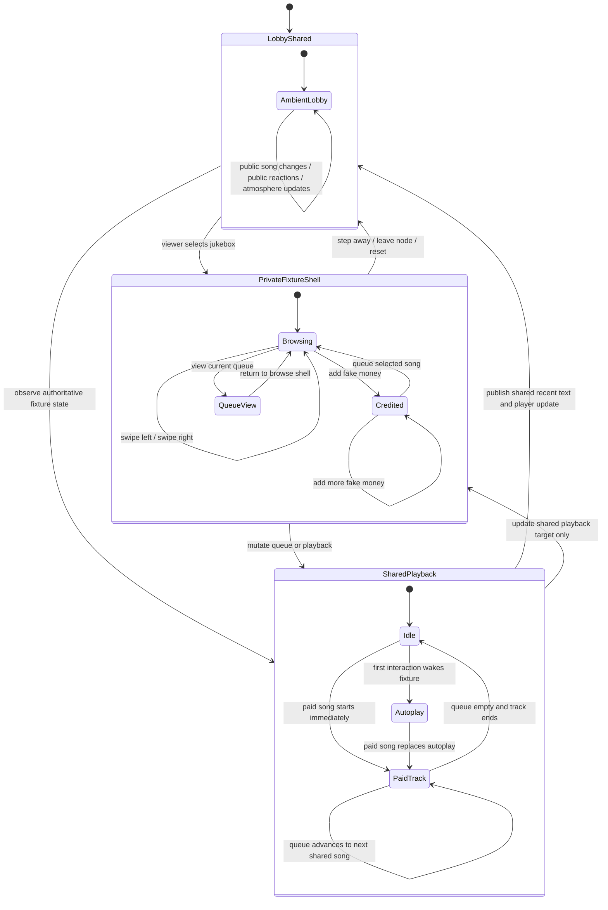
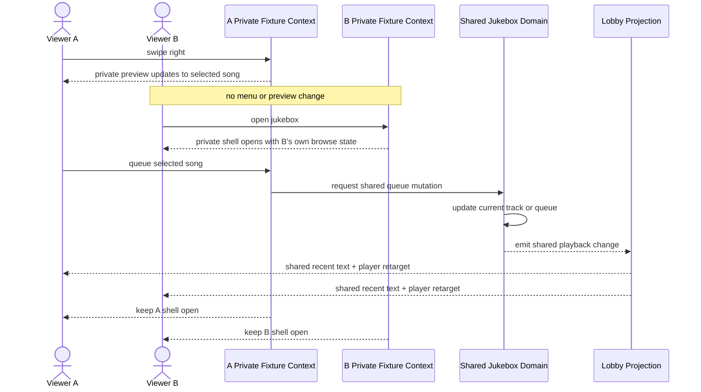

# Audience And Fixture Contexts v1

This document describes the target architecture for shared text, private text, and same-node fixture interaction.

Use it when changing fixture interaction, multiplayer-visible room text, POV-specific text, or any system where one runtime event may need to project different results to different viewers.

This is a target contract, not a statement that the current code already fully satisfies it.

If current code disagrees with this file, treat this file as the direction the runtime should converge toward.

## Why This Exists

The current runtime already distinguishes text lane and same-node fixture focus, but it does not yet have a first-class audience model.

That gap now matters for two reasons:

- fixture interaction has both shared and private surfaces
- multiplayer text needs more than one public-or-private bucket

The PrototypeHub jukebox makes the problem obvious, but the same model should also support broader perception behavior.

Examples include:

- public room reaction text everyone present sees
- actor-only reaction text
- POV replacement text for one specific character
- targeted text one viewer sees about another character

## Core Rule

One runtime event may produce multiple projections for different audiences without forking the shared world state.

The system should separate:

- authoritative shared world and fixture state
- per-viewer interaction context
- per-viewer projection output
- purely local renderer preferences

## Four State Buckets

### 1. Shared World State

This is authoritative server-owned state.

Use it for anything other players in the same place must agree on.

Examples:

- current jukebox track
- queue order
- track timing
- ambient simulation state
- room-visible reactions and events

### 2. Private Interaction Context

This is server-owned but viewer-scoped or player-scoped interaction state.

Use it for same-node control shells that should not leak to other viewers.

Examples:

- which fixture a player is currently using
- current browse selection
- queue panel open versus browse panel open
- fake money held inside one player's jukebox interaction shell

This state must not be stored in shared world fixture objects.

### 3. Private Projection Output

This is canonical runtime output for one viewer.

Use it for gameplay-facing text that should exist in the session output, but only for a specific viewer or subset of viewers.

Examples:

- actor-only reaction text
- POV replacement text
- one-character-only commentary about another character

The client should render this output, not compose it.

### 4. Renderer-Local Preferences

This is client-local display state.

Use it only when it does not change gameplay truth.

Examples:

- mute on a YouTube player
- pane collapsed state
- temporary local focus styling

Mute belongs here. Pause does not, because playback position is authoritative shared fixture state.

## Audience Model

The runtime should treat audience separately from lane.

Lane answers where text appears.

Audience answers who receives it.

Current lanes remain useful:

- `visible`
- `recent`

Target audiences should expand to something like:

- `shared`
- `actor`
- `viewer`
- `viewers_matching_predicate`

The exact type names can change, but the model should support those roles.

## Delivery Modes

Audience alone is not enough.

The runtime also needs to know how a projection affects existing output.

The minimum useful delivery modes are:

- `append`: add a new entry or block
- `replace_scope`: replace prior output in one logical scope such as a queue panel or live preview panel
- `replace_shared_for_viewer`: hide or replace one shared block for a specific viewer when POV text should override what they personally read

That last mode is what makes the perception system more than just public text plus whispers.

## Jukebox Mapping

The PrototypeHub jukebox should split into these buckets.

### Shared Jukebox State

- `currentTrack`
- `currentTrackLabel`
- `currentTrackMode`
- `currentTrackStartedAtMs`
- `currentTrackEndsAtMs`
- `queueTrackIds`
- any derived shared playback revision or scheduler marker

### Private Jukebox Interaction Context

- `focused`
- `browseIndex`
- `fakeCredits`
- current interaction mode such as browse or queue view

### Shared Or Domain-Scheduler State That Should Not Stay In The Interaction Shell

- `lobbyAtmosphereTrackId`
- `lobbyAtmosphereTick`

Those fields are closer to shared playback decoration or scheduler bookkeeping than to per-viewer control state.

### Client-Local Only

- mute state

## Non-Clobber Rule For Concurrent Fixture Use

Two viewers looking at the same fixture instance at the same time must not overwrite each other's private interaction context.

That means:

- one viewer swiping left or right must not move the other viewer's browse cursor
- one viewer opening queue view must not replace the other viewer's private panel
- one viewer adding fake money must not change another viewer's fake money buffer
- one viewer stepping away must not close another viewer's interaction shell

At the same time, shared playback mutations must still fan out correctly.

That means:

- when a queued song becomes the current shared track, everyone in the lobby gets the shared recent-text update
- when the track changes, everyone who is allowed to see the player gets the new server-following playback target
- viewers already using the jukebox keep their private interaction shell open while the shared playback state updates under it

## Jukebox State Machine



## Concurrent Viewer Flow



## Perception Projection Model

The same audience model should handle non-fixture text.

One authored or simulated event may produce:

- a shared visible block
- an actor-only visible replacement
- an actor-only recent reaction
- a specific-viewer-only comment

Example shape:

- Shared visible: `The technological advance of this city is amazing!`
- Private replacement for one viewer: `You've seen it all, but apparently not everyone else has.`
- Private reaction for that viewer: `You feel a yawn coming on.`
- Shared recent: `{character} yawns after taking it all in.`
- Private recent for another viewer: `Of course {character} wouldn't be impressed. He designed the damn thing.`

This is why the runtime should not treat text as one page plus one shared recent-log list.

It should treat text as audience-targeted emissions that later resolve into a viewer-specific canonical page.

## Implementation Direction

The cleanest next shape is:

1. Introduce an audience-aware runtime emission type before changing authoring syntax.
2. Keep projection lane metadata, but add audience and delivery mode before final page assembly.
3. Build canonical page output per viewer from the same shared simulation step.
4. Split fixture interaction context from shared fixture object state.
5. Keep mute and similar controls out of runtime truth.
6. Add multi-viewer tests that prove private fixture contexts do not clobber one another.

## Likely Runtime Shape

This is illustrative, not final API contract.

```ts
type RuntimeAudience =
  | { kind: 'shared' }
  | { kind: 'actor'; actorId: string }
  | { kind: 'viewer'; viewerId: string }
  | { kind: 'viewers_matching_predicate'; predicateId: string };

type RuntimeDeliveryMode =
  | { kind: 'append' }
  | { kind: 'replace_scope'; scope: string }
  | { kind: 'replace_shared_for_viewer'; scope: string };

interface RuntimeProjectionEmission {
  lane: 'visible' | 'recent';
  audience: RuntimeAudience;
  delivery: RuntimeDeliveryMode;
  text: string;
}
```

The important part is not the exact type names.

The important part is that audience and replacement semantics must become explicit runtime concepts.

## Current Code Gaps

Current code already has useful starting points:

- projection has lane metadata
- runtime already accepts `actorId` and `viewerId`
- fixture interaction already has same-node focus

Current code also has clear gaps:

- focused fixture state is still stored on shared object state
- private queue and preview panels are still encoded as recent-log mutations
- runtime page assembly does not yet model multiple audiences as first-class outputs
- the current build path still collapses actor and viewer to the same active player in common cases

## What Should Stay True During Refactor

- shared playback remains authoritative and server-following
- the client does not invent gameplay-facing prose
- fixture interaction stays same-node rather than moving to a fake sub-room
- private fixture menus remain private
- shared song changes still propagate to everyone who should observe them
- two people using the same fixture at once do not stomp each other's interaction state
- mute remains viewer-local and does not affect anyone else