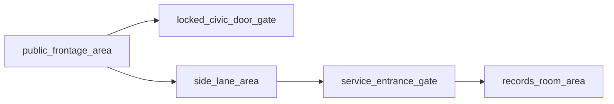

# Civic Frontage

## Purpose

Use this when the building should first read as officially closed from the public side, while still supporting a quieter alternate route.

## Expected Output

- `5 content files`
- optional `1 layout README`

## Node Inventory

1. public frontage Area
2. locked civic door Gate
3. side lane Area
4. service entrance Gate
5. interior records Area

## Recommended Graph Shape



## Suggested Bundle Folder

```text
civic_frontage_bundle/
  README.md
  public_frontage_area.md
  locked_civic_door_gate.md
  side_lane_area.md
  service_entrance_gate.md
  records_room_area.md
```

## Why This Layout Helps

- gives the front threshold a visible narrative role even when it is blocked
- keeps alternate access legible without sprawling into a large district map
- cleanly supports office, clinic, records, and municipal tones

## Variation Ideas

- archive with posted hours
- clinic closed for the evening
- municipal office with staff entry around the side
- suspicious records annex with a quieter back approach

## Related Object Presets

- `objects/gates/locked_civic_door.md`
- `objects/gates/service_entrance.md`
- `objects/areas/street_corner.md`

## Related Bundle

- `civic_frontage_bundle/`