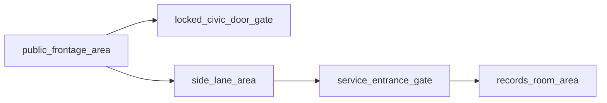

# Civic Frontage Bundle

This folder shows the exact file set an AI would usually generate for the `civic_frontage` layout.

## File Count

- `5 content files`
- `1 bundle README`

## Graph Shape

## Files

- `public_frontage_area.md`
- `locked_civic_door_gate.md`
- `side_lane_area.md`
- `service_entrance_gate.md`
- `records_room_area.md`

## Intent

Use this bundle when the public face of the building should deny access, but the location still needs a second, lower-profile way in.