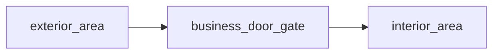

# Shopfront

## Purpose

Use this when the exterior threshold matters, but the whole building does not need a large multi-room layout yet.

## Expected Output

- `3 content files`
- optional `1 layout README`

## Node Inventory

1. exterior Area
2. business door Gate
3. interior Area

## Recommended Graph Shape



## Suggested Bundle Folder

```text
shopfront_bundle/
  README.md
  exterior_area.md
  business_door_gate.md
  interior_area.md
```

## Why This Layout Helps

- keeps the storefront readable
- gives the threshold a visible role
- avoids overbuilding a business location too early
- scales naturally into richer interiors later

## Variation Ideas

- open shop versus closed shop
- shabby versus formal business
- public-facing service versus suspicious back-room tone

## Related Object Presets

- `objects/gates/billboard_business_door.md`
- `objects/gates/service_entrance.md`
- `objects/areas/one_room_shack.md`

## Related Bundle

- `shopfront_bundle/`