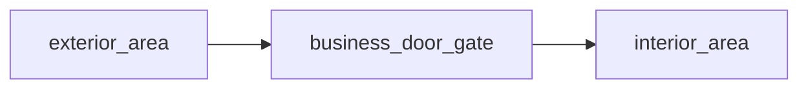

# Shopfront Bundle

This folder shows the exact file set an AI would usually generate for the `shopfront` layout.

## File Count

- `3 content files`
- `1 bundle README`

## Graph Shape

## Files

- `exterior_area.md`
- `business_door_gate.md`
- `interior_area.md`

## Intent

Use this bundle for small businesses, clinics, offices, or service counters where the threshold matters more than interior traversal.