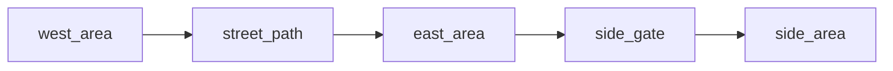

# Street With Side Threshold

## Purpose

Use this when the main route should feel like a traversal segment, and one of the route's Area stops should expose an optional side threshold.

## Expected Output

- `5 content files`
- `1 layout README` if you want the bundle to stay self-describing

## Node Inventory

1. west Area
2. main street Path
3. east Area
4. side Gate
5. side destination Area

Current runtime note:

The side threshold should hang off an Area, not directly off a Path, because Paths currently resolve through traversal controls rather than side-exit actions.

## Recommended Graph Shape



## Suggested Bundle Folder

```text
street_with_side_threshold_bundle/
  README.md
  west_area.md
  street_path.md
  east_area.md
  side_gate.md
  side_area.md
```

Use a bundle folder like this when you want the AI to understand the full deliverable set, not just the abstract layout pattern.

## Why This Layout Helps

- keeps the main route readable
- gives one optional threshold without relying on unsupported side exits from a Path
- supports boulevard, corridor, lane, or harbor-road fiction
- lets the side threshold be billboarded, blocked, or passthrough later

## Variation Ideas

- boulevard with shopfront
- corridor with side office
- alley with service door
- harbor road with one small lookout or shed entrance

## Related Object Presets

- `objects/paths/paged_street_segment.md`
- `objects/gates/billboard_business_door.md`
- `objects/areas/one_room_shack.md`

## Related Bundle

- `street_with_side_threshold_bundle/`