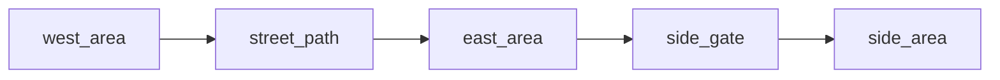

# Street With Side Threshold Bundle

This folder shows the exact file set an AI would usually generate for the `street_with_side_threshold` layout.

## File Count

- `5 content files`
- `1 bundle README`

## Graph Shape

## Runtime Note

This bundle uses the side threshold off `east_area` rather than directly off `street_path` because current Path pages do not expose side-exit actions.

## Files

- `west_area.md`
- `street_path.md`
- `east_area.md`
- `side_gate.md`
- `side_area.md`

## Intent

Use this bundle when you want a main route plus one optional threshold stop.

Keep the node prose stripped at first.

Add richer style only after the file set and routing are correct.