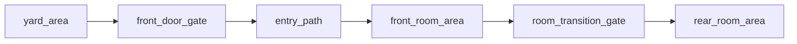

# Two-Room House

## Purpose

Use this when a single interior page is too crowded but the location still wants to feel compact.

## Expected Output

- `6 content files`
- optional `1 layout README`

## Node Inventory

1. exterior Area
2. front-door Gate
3. short interior Path
4. room-transition Gate
5. front room Area
6. rear room Area

## Recommended Graph Shape



## Suggested Bundle Folder

```text
two_room_house_bundle/
  README.md
  yard_area.md
  front_door_gate.md
  entry_path.md
  front_room_area.md
  room_transition_gate.md
  rear_room_area.md
```

## Why This Layout Helps

- keeps each room inspectable
- avoids overloading one Area with too many POIs
- keeps threshold logic available for later changes
- allows the front room and rear room to have different exit density and tone

## Variation Ideas

- living room plus storage room
- kitchen plus sleeping room
- public room plus private room
- intact front room plus ruined back room

## Related Object Presets

- `objects/areas/one_room_shack.md`
- `objects/gates/billboard_business_door.md`
- `objects/paths/minimal_passthrough_connector.md`

## Related Bundle

- `two_room_house_bundle/`