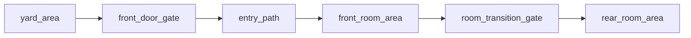

# Two-Room House Bundle

This folder shows the exact file set an AI would usually generate for the `two_room_house` layout.

## File Count

- `6 content files`
- `1 bundle README`

## Graph Shape

## Files

- `yard_area.md`
- `front_door_gate.md`
- `entry_path.md`
- `front_room_area.md`
- `room_transition_gate.md`
- `rear_room_area.md`

## Intent

Use this bundle when one interior Area would be too crowded, but a larger mansion or compound layout would be excessive.

Keep the node prose stripped at first.

Add richer style after the file set and routing are correct.