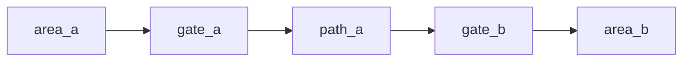

# Layout Preset Name

## Purpose

Describe the composition shape and why multiple nodes are useful here.

## Expected Output

State how many authored content files this layout usually expands into.

Example:

- `5 content files`
- `1 layout README`

## Node Inventory

1. node one
2. node two
3. node three

## Recommended Graph Shape

Use Mermaid so an external AI can parse the structure more reliably than plain text arrows.



## Suggested Bundle Folder

Show the file set the AI is expected to produce.

```text
layout_bundle/
  README.md
  node_a.md
  node_b.md
  node_c.md
```

## Required Support Patterns

-

## Variation Ideas

-

## Minimal Layout Sketch

```text
area_a -> gate_a -> path_a -> gate_b -> area_b
```

## Authoring Notes

-

## Related Object Presets

-